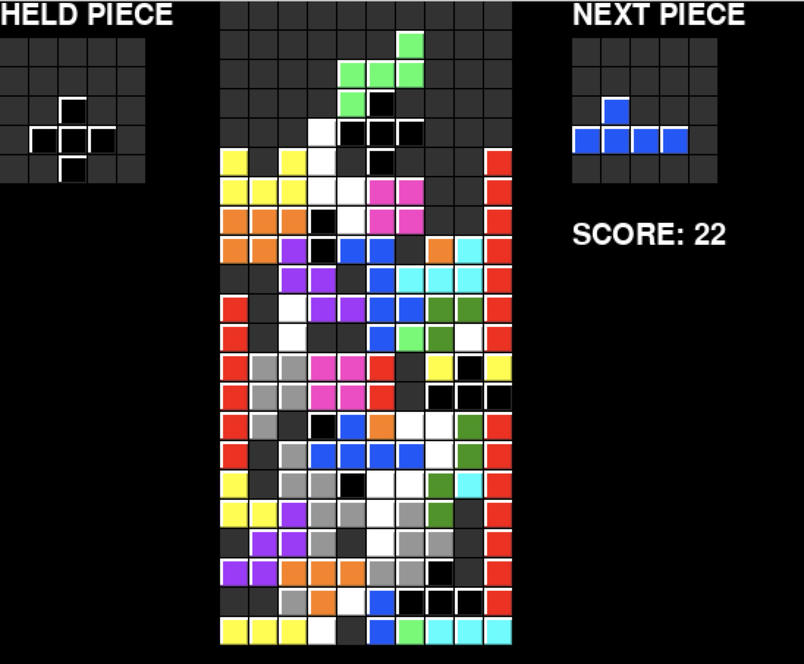

# Pentris
I wondered how much harder tetris would be with pentominoes, so I made this. Unlike normal tetris, you can reflect pieces, which makes it easier. Still, it's still a lot harder than normal tetris. I still haven't managed to consistently survive with the pieces falling at a constant speed, so I haven't made it speed up.



### To Run
Linux/MacOS:
```
git clone https://github.com/mister-person/pentris.git
cd pentris
python3 -m venv venv
source venv/bin/activate
pip install pygame
python3 pentris.py
```

### Controls 
left/right: move left/right
up: rotate right
z: rotate left
x: flip piece
space: drop piece
left shift: hold piece
r: new game

### Tips
- Pay attention to the holes shapes fit into
- Sometimes a piece will only fit somewhere if you use x to flip it
- If you are forced to cover a hole, try to avoid putting more pieces over it
- Some shapes are worse than others, hold them if you need to but try to keep good pieces held
- The easiest pieces to use are the 4 and 5 long pieces, and the "7" and "p" shaped pieces
- The + piece is the worst, try to keep places to put them if you can, and don't hold them for too long

My high score is 247.
